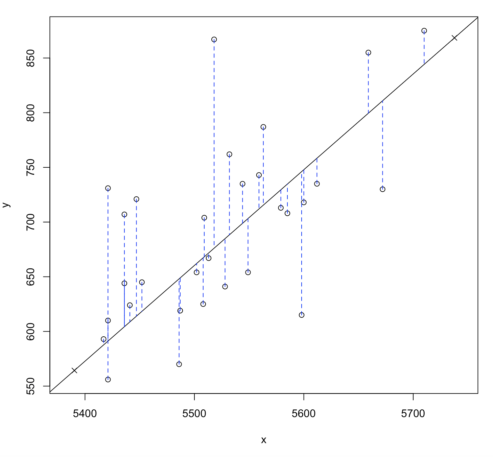
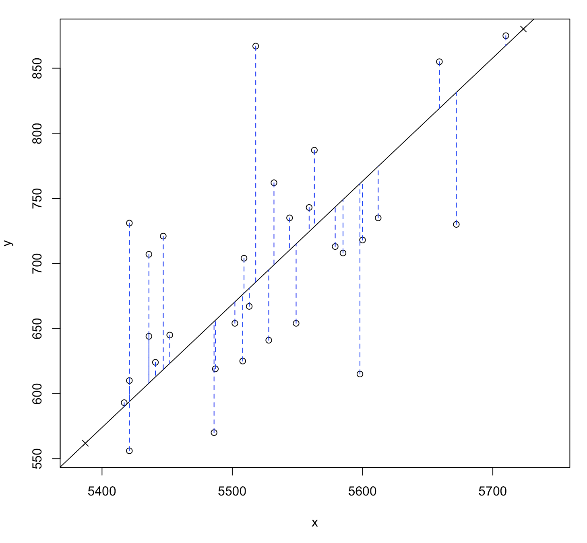
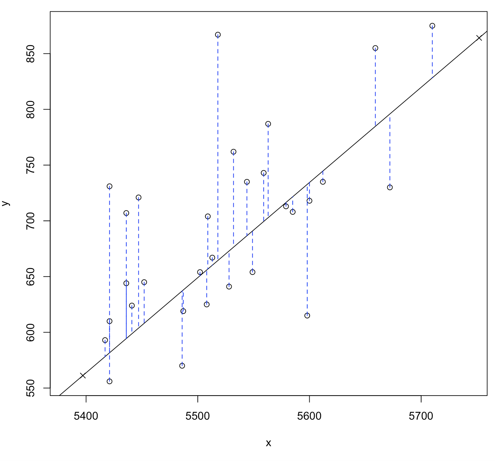

## Batter up 

The movie [Moneyball](http://en.wikipedia.org/wiki/Moneyball_(film)) focuses on
the "quest for the secret of success in baseball". It follows a low-budget team, 
the Oakland Athletics, who believed that underused statistics, such as a player's 
ability to get on base, better predict the ability to score runs than typical 
statistics like home runs, RBIs (runs batted in), and batting average. Obtaining 
players who excelled in these underused statistics turned out to be much more 
affordable for the team.

In this lab we'll be looking at data from all 30 Major League Baseball teams and
examining the linear relationship between runs scored in a season and a number 
of other player statistics. Our aim will be to summarize these relationships 
both graphically and numerically in order to find which variable, if any, helps 
us best predict a team's runs scored in a season.

## The data

Let's load up the data for the 2011 season.

```{r load-data, eval=TRUE}
load("more/mlb11.RData")
```

In addition to runs scored, there are seven traditionally used variables in the 
data set: at-bats, hits, home runs, batting average, strikeouts, stolen bases, 
and wins. There are also three newer variables: on-base percentage, slugging 
percentage, and on-base plus slugging. For the first portion of the analysis 
we'll consider the seven traditional variables. At the end of the lab, you'll 
work with the newer variables on your own.

1.  What type of plot would you use to display the relationship between `runs` 
    and one of the other numerical variables? Plot this relationship using the 
    variable `at_bats` as the predictor. Does the relationship look linear? If 
    you knew a team's `at_bats`, would you be comfortable using a linear model 
    to predict the number of runs?
    
**A scattered plot is the best was to display this relationship. Below is a graph for at_bat against runs. The relationship does look linear. I would be comfortable making a prediction of runs based on at bats, but because of the spreading we see in the data, I wouldn't expect it to be very accurate. Some level of accuracy would make the prediction more meaningful.**

```{r}
plot(mlb11$at_bats,mlb11$runs,main = "MLB 11",xlab = "At bats",ylab = "Runs")
```


If the relationship looks linear, we can quantify the strength of the
relationship with the correlation coefficient.

```{r cor, eval=TRUE}
cor(mlb11$runs, mlb11$at_bats)
```

## Sum of squared residuals

Think back to the way that we described the distribution of a single variable. 
Recall that we discussed characteristics such as center, spread, and shape. It's
also useful to be able to describe the relationship of two numerical variables, 
such as `runs` and `at_bats` above.

2.  Looking at your plot from the previous exercise, describe the relationship 
    between these two variables. Make sure to discuss the form, direction, and 
    strength of the relationship as well as any unusual observations.

**The data shows these two variables are positively correlated, with one increasing with the other. There is some sparsity in the data. The correlation isn't particularly large. There do seem to be some outliers. Particularly we can see a point at around 5600 on the x axis (at bats) which shows a low y (runs). But we also see some point with particularly high runs for the number of at bats.**

```{r}
par(mfrow=c(1,2))
boxplot(mlb11$at_bats, main = "At Bats")
boxplot(mlb11$runs, main = "Runs")
```


Just as we used the mean and standard deviation to summarize a single variable, 
we can summarize the relationship between these two variables by finding the 
line that best follows their association. Use the following interactive 
function to select the line that you think does the best job of going through 
the cloud of points.

```{r plotss-atbats-runs, eval=TRUE}
plot_ss(x = mlb11$at_bats, y = mlb11$runs)
```

After running this command, you'll be prompted to click two points on the plot 
to define a line. Once you've done that, the line you specified will be shown in
black and the residuals in blue. Note that there are 30 residuals, one for each 
of the 30 observations. Recall that the residuals are the difference between the
observed values and the values predicted by the line:

\[
  e_i = y_i - \hat{y}_i
\]

The most common way to do linear regression is to select the line that minimizes
the sum of squared residuals. To visualize the squared residuals, you can rerun 
the plot command and add the argument `showSquares = TRUE`.

```{r plotss-atbats-runs-squares, eval=TRUE}
plot_ss(x = mlb11$at_bats, y = mlb11$runs, showSquares = TRUE)
```

Note that the output from the `plot_ss` function provides you with the slope and
intercept of your line as well as the sum of squares.

3.  Using `plot_ss`, choose a line that does a good job of minimizing the sum of
    squares. Run the function several times. What was the smallest sum of 
    squares that you got? How does it compare to your neighbors?

**After running this exercise manually several times, it was hard to obtain a minimum sum of squares. Manually, in each iteration, it is hard to draw a line with better results than the previous.**


Call:
lm(formula = y ~ x, data = pts)

Coefficients:
(Intercept)            x  
 -4154.6049       0.8754  

Sum of Squares:  139645.2



Call:
lm(formula = y ~ x, data = pts)

Coefficients:
(Intercept)            x  
 -4538.1907       0.9467  

Sum of Squares:  142438.4



Call:
lm(formula = y ~ x, data = pts)

Coefficients:
(Intercept)            x  
 -4046.0652       0.8537  

Sum of Squares:  150912.7

## The linear model

It is rather cumbersome to try to get the correct least squares line, i.e. the 
line that minimizes the sum of squared residuals, through trial and error. 
Instead we can use the `lm` function in R to fit the linear model (a.k.a. 
regression line).

```{r m1, eval=TRUE}
m1 <- lm(runs ~ at_bats, data = mlb11)
```

The first argument in the function `lm` is a formula that takes the form 
`y ~ x`. Here it can be read that we want to make a linear model of `runs` as a 
function of `at_bats`. The second argument specifies that R should look in the 
`mlb11` data frame to find the `runs` and `at_bats` variables.

The output of `lm` is an object that contains all of the information we need 
about the linear model that was just fit. We can access this information using 
the summary function.

```{r summary-m1, eval=TRUE}
summary(m1)
```

Let's consider this output piece by piece. First, the formula used to describe 
the model is shown at the top. After the formula you find the five-number 
summary of the residuals. The "Coefficients" table shown next is key; its first 
column displays the linear model's y-intercept and the coefficient of `at_bats`.
With this table, we can write down the least squares regression line for the 
linear model:

\[
  \hat{y} = -2789.2429 + 0.6305 * atbats
\]

One last piece of information we will discuss from the summary output is the 
Multiple R-squared, or more simply, $R^2$. The $R^2$ value represents the 
proportion of variability in the response variable that is explained by the 
explanatory variable. For this model, 37.3% of the variability in runs is 
explained by at-bats.

4.  Fit a new model that uses `homeruns` to predict `runs`. Using the estimates 
    from the R output, write the equation of the regression line. What does the 
    slope tell us in the context of the relationship between success of a team 
    and its home runs?
    
```{r}
m2 <- lm(runs ~ homeruns, data = mlb11)
summary(m2)
```

\[
  \hat{y} = 4152389 + 1.8345 * homeruns
\]

**The relationship between homeruns and runs is positive, that is, more home runs equates to a team producing more runs.**

## Prediction and prediction errors

Let's create a scatterplot with the least squares line laid on top.

```{r reg-with-line, eval=TRUE}
plot(mlb11$runs ~ mlb11$at_bats)
abline(m1)
```

The function `abline` plots a line based on its slope and intercept. Here, we 
used a shortcut by providing the model `m1`, which contains both parameter 
estimates. This line can be used to predict $y$ at any value of $x$. When 
predictions are made for values of $x$ that are beyond the range of the observed
data, it is referred to as *extrapolation* and is not usually recommended. 
However, predictions made within the range of the data are more reliable. 
They're also used to compute the residuals.

5.  If a team manager saw the least squares regression line and not the actual 
    data, how many runs would he or she predict for a team with 5,578 at-bats? 
    Is this an overestimate or an underestimate, and by how much? In other 
    words, what is the residual for this prediction?
    
**We use the least squares regression line to calculate runs as shown below. This results in 727.6861 runs. We do not know if this is an overestimate or underestimate, this is the value at the regression line, so the residual is zero.**

```{r}
-2789.2429 + 0.6305 * 5578
```

## Model diagnostics

To assess whether the linear model is reliable, we need to check for (1) 
linearity, (2) nearly normal residuals, and (3) constant variability.

*Linearity*: You already checked if the relationship between runs and at-bats
is linear using a scatterplot. We should also verify this condition with a plot 
of the residuals vs. at-bats. Recall that any code following a *#* is intended
to be a comment that helps understand the code but is ignored by R.

```{r residuals, eval=TRUE}
plot(m1$residuals ~ mlb11$at_bats)
abline(h = 0, lty = 3)  # adds a horizontal dashed line at y = 0
```

6.  Is there any apparent pattern in the residuals plot? What does this indicate
    about the linearity of the relationship between runs and at-bats?

**We do not see a pattern which suggest there is linearity between runs and at-bats.**

*Nearly normal residuals*: To check this condition, we can look at a histogram

```{r hist-res, eval=TRUE}
hist(m1$residuals)
```

or a normal probability plot of the residuals.

```{r qq-res, eval=TRUE}
qqnorm(m1$residuals)
qqline(m1$residuals)  # adds diagonal line to the normal prob plot
```

7.  Based on the histogram and the normal probability plot, does the nearly 
    normal residuals condition appear to be met?

**Yes, we see a normal shaped historgram plus the probability plot shows all points very close to the line.** 

*Constant variability*:

8.  Based on the plot in (1), does the constant variability condition appear to 
    be met?

**Yes, this condition seems to be met, although we do see what seems to be an outlier at 5525**    

* * *

## On Your Own

-   Choose another traditional variable from `mlb11` that you think might be a 
    good predictor of `runs`. Produce a scatterplot of the two variables and fit 
    a linear model. At a glance, does there seem to be a linear relationship?
    
**Selecting the wins variable from the dataset, at a glance we see a linear positive relationship with runs.**

```{r}
m3 <- lm(runs ~ wins, data = mlb11)
summary(m3)

plot(mlb11$runs ~ mlb11$wins)
abline(m3)
```


2-   How does this relationship compare to the relationship between `runs` and 
    `at_bats`? Use the R$^2$ values from the two model summaries to compare. 
    Does your variable seem to predict `runs` better than `at_bats`? How can you
    tell?
    
**The variable selected wins has an R-squared  of 0.361, that means 36.1% of the variability of runs is explained by wins. This compared to at_bats, which shows that 37.29% of the variability in runs is explained by at-bats. The explanatory variable at_bats explains a larger proportion of the variability of runs compared to wins.**

```{r}
summary(m3) #wins

summary(m1) #at_bats
```


3-   Now that you can summarize the linear relationship between two variables, 
    investigate the relationships between `runs` and each of the other five 
    traditional variables. Which variable best predicts `runs`? Support your 
    conclusion using the graphical and numerical methods we've discussed (for 
    the sake of conciseness, only include output for the best variable, not all 
    five).
    
**As shown below we first find the variable with the best R-squared. We found that bat_avg has the highest R-Squared, which means the proportion of variability in runs can be best explained by the bat_avg variable.**
**We then looked at the summary and the scattered plot of the two variables with the least squared error line. As can be seed the relationships seems to be linear. We also plotted the residuals and didn't see any pattern in the scattered plot. Then looked at the histogram of the residuals and the probability plot, both show the data being normal as expected for a good linear correlation.**
    
```{r}
m<-vector()
n<-3
for(i in 3:9) {
  m[i]=(cor(mlb11$runs,mlb11[[i]]))^2
  print(paste(names(mlb11)[i],m[i]))
  if(i>3) {
    if(m[i]>m[n]) {
      n<-i
    }
  }
}
print(paste("Best R_square:",names(mlb11)[n]))

m_max<-lm(runs ~ bat_avg,data=mlb11)
summary(m_max)
plot(mlb11$runs ~ mlb11$bat_avg)
abline(m_max)
plot(m_max$residuals ~ mlb11$bat_avg)
abline(h = 0, lty = 3)
hist(m_max$residuals)
qqnorm(m_max$residuals)
qqline(m_max$residuals)
```
    

4-   Now examine the three newer variables. These are the statistics used by the 
    author of *Moneyball* to predict a teams success. In general, are they more 
    or less effective at predicting runs that the old variables? Explain using 
    appropriate graphical and numerical evidence. Of all ten variables we've 
    analyzed, which seems to be the best predictor of `runs`? Using the limited 
    (or not so limited) information you know about these baseball statistics, 
    does your result make sense?

**We calculate the R-squared for the new variables, and then compare against the traditional variables. We find that in fact the new variables are better predictors, with their R-squared showing larger values (shown on the bar plot below).**
**The best predictor variable, with the highest R-square is new_obs, on-base plus slugging**
**We look at the least squared error line and residuals plot for all three new variables. We want to see a linear relationship and no pattern on the residuals plot.**

```{r}
n<-10
for(i in 10:12) {
  m[i]=(cor(mlb11$runs,mlb11[[i]]))^2
  print(paste(names(mlb11)[i],m[i]))
  if(i>3) {
    if(m[i]>m[n]) {
      n<-i
    }
  }
}
print(paste("Best R_square:",names(mlb11)[n]))

barplot(m)

m_newOnBase<-lm(runs ~ new_onbase,data=mlb11)
summary(m_newOnBase)
plot(mlb11$runs ~ mlb11$new_onbase)
abline(m_newOnBase)
plot(m_newOnBase$residuals ~ mlb11$new_onbase)
abline(h = 0, lty = 3)

m_newSlug<-lm(runs ~ new_slug,data=mlb11)
summary(m_newSlug)
plot(mlb11$runs ~ mlb11$new_slug)
abline(m_newSlug)
plot(m_newSlug$residuals ~ mlb11$new_slug)
abline(h = 0, lty = 3)

m_newObs<-lm(runs ~ new_obs,data=mlb11)
summary(m_newObs)
plot(mlb11$runs ~ mlb11$new_obs)
abline(m_newObs)
plot(m_newObs$residuals ~ mlb11$new_obs)
abline(h = 0, lty = 3)

```


5-   Check the model diagnostics for the regression model with the variable you 
    decided was the best predictor for runs.
    
**Variable selected was new_obs**
**We look at the same regression and residual scattered plots as before, and we also look at the distribution of the residuals to make sure they it is normal. We see this is the case in the distribution plot and the probability plot.**

```{r}
m_newObs<-lm(runs ~ new_obs,data=mlb11)
summary(m_newObs)
plot(mlb11$runs ~ mlb11$new_obs)
abline(m_newObs)
plot(m_newObs$residuals ~ mlb11$new_obs)
abline(h = 0, lty = 3)
hist(m_newObs$residuals)
qqnorm(m_newObs$residuals)
qqline(m_newObs$residuals)
```


<div id="license">
This is a product of OpenIntro that is released under a [Creative Commons 
Attribution-ShareAlike 3.0 Unported](http://creativecommons.org/licenses/by-sa/3.0). 
This lab was adapted for OpenIntro by Andrew Bray and Mine &Ccedil;etinkaya-Rundel 
from a lab written by the faculty and TAs of UCLA Statistics.
</div>
